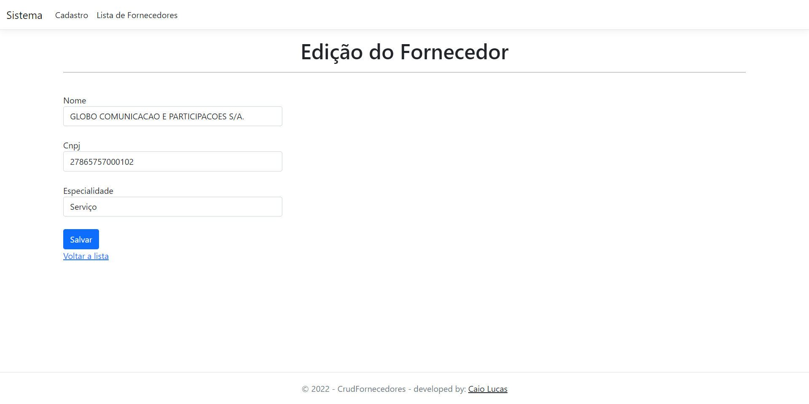
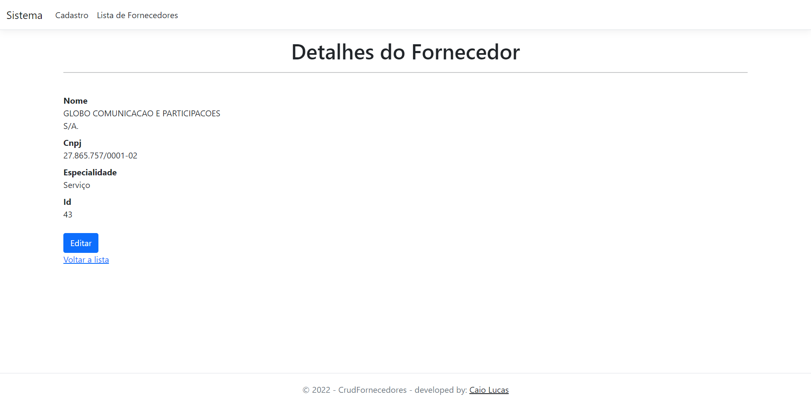
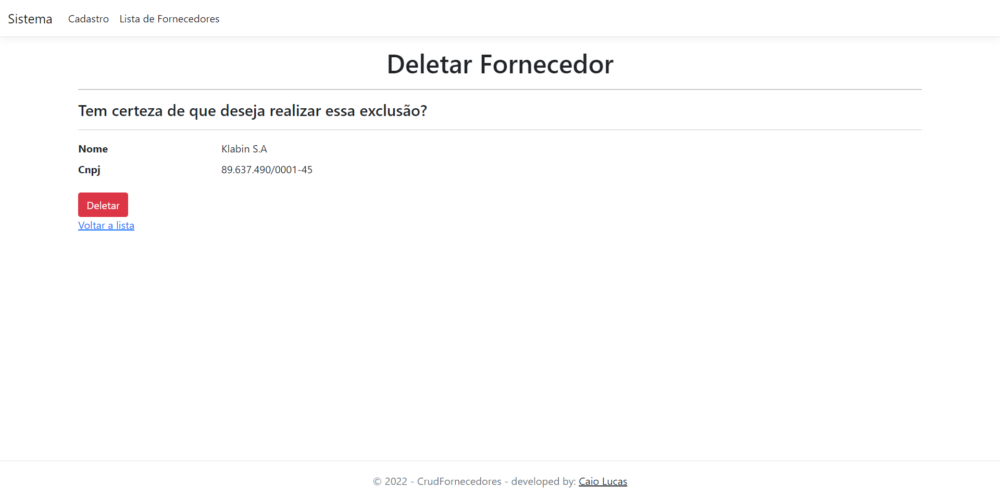

# Sistema CRUD feito com ASP.NET

 

<h2>Tela de Boas-Vindas:</h2>
 
<a href="#">
 
</a>

 
 

<h2>Cadastro de Fornecedores:</h2>
<a href="#">
 
</a>

 
 

<h2>Edição de Fornecedor:</h2>
<a href="#">
 
</a>

 
 

<h2>Detalhes do Fornecedor:</h2>
<a href="#">
 
</a>

 
 

<h2>Lista de Fornecedores:</h2>
<a href="#">
 
</a>

 
 

<h2>Deleção de Fornecedores:</h2>
<a href="#">
 
</a>

 
